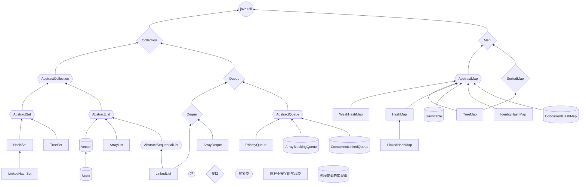
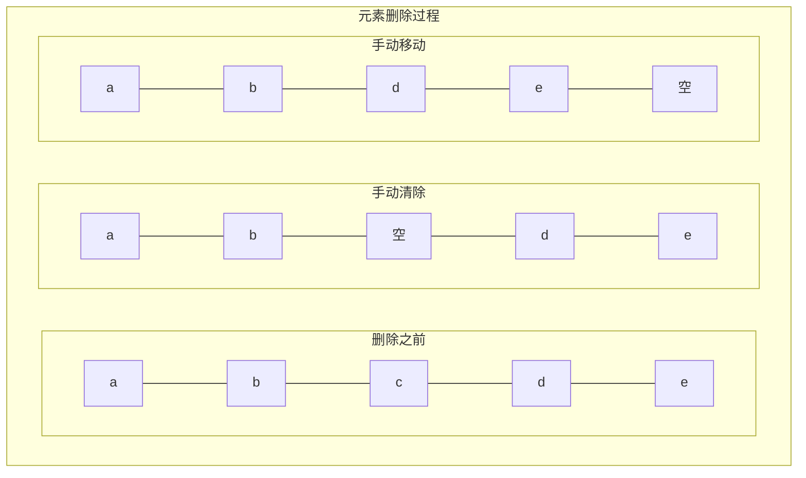
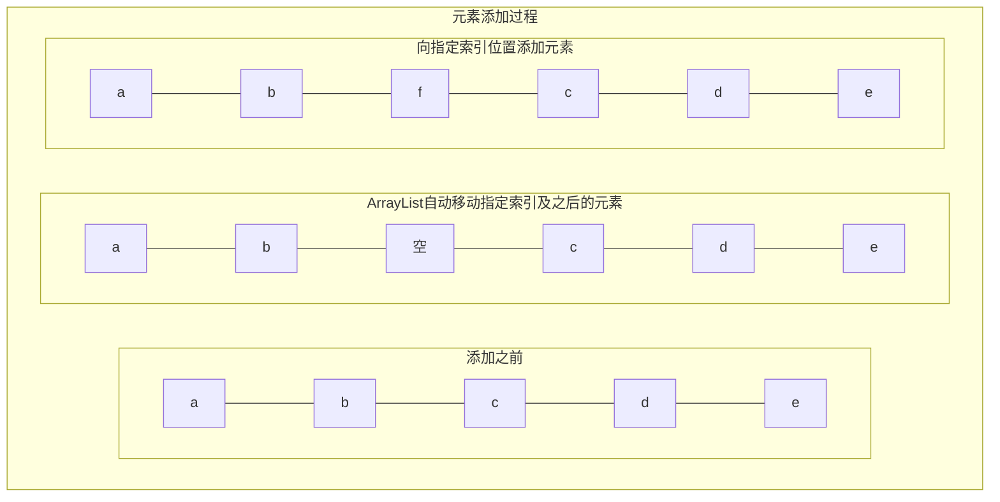
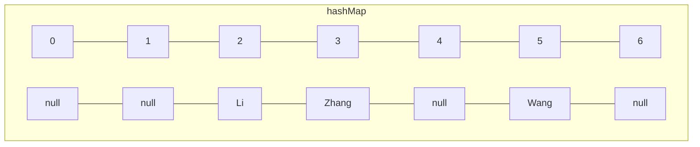

# Java集合类关系&机制&安全分析总结

## 概要
1. 研究Java集合类的全貌和各集合类之间的继承关系和差异
2. 举例详细介绍其中一些集合类的内部实现机制
3. 使用这些集合类过程中是否会存在不当使用造成的安全问题

## Java集合类的关系
### 集合概述
在数学和生活中，我们经常遇到集合的概念。例如：
- 有限集合
    * 一个班所有的同学构成的集合；
    * 一个网站所有的商品构成的集合；
    * ···
- 无限集合
    * 全体自然数集合：0，1，2，3，···
    * 有理数集合；
    * 实数集合；
    * ···

而在计算机中引入集合可以方便地处理一组类似的数据，例如：
- 计算所有学生的总成绩和平均成绩；
- 列举所有的商品名称和价格；
- ··

**定义**：可以在内部持有若干其他Java对象，并对外提供访问接口的Java对象。
显然，Java的数组也满足这个定义，也可以看作是一种集合：
```java
String[] s = new String[10]; // 定义一个可以持有10个String对象的数组
s[0] = "abc"; // 可以存入String对象
String ss = s[0]; // 外部可以访问并获取s持有的String对象
```
既然Java提供的数组可以充当集合，那么为什么需要引入新的集合类？这是因为数组有如下限制：
- 数组初始化后长度不可变；
- 数组无法避免元素重复；
- 数组只能按索引顺序存取。

Java针对上述三个问题提供了三种类型的集合以满足需求：
- List：一种支持自动扩容的集合；
- Set：一种不允许有重复元素的集合；
- Map：一种可以根据元素值索引的集合。
在Java中，这三种集合都位于java.util包下。

### 三种集合类的继承关系
<p style="text-align: center">
java标准集合类继承关系
</p>
<p style="text-align: center">
  

</p>


**集合类**|**类描述**
:-:|:-:
*AbstractCollection*|实现了大部分的Collection接口
*AbstractList*|继承于 AbstractCollection 并且实现了大部分List接口
*AbstractSequentialList*|继承于  AbstractList ，提供了对数据元素的链式访问而不是随机访问
**ArrayList**|通过继承 AbstractList，实现动态数组
**LinkedList**|继承于 AbstractSequentialList，实现了一个链表
*AbstractSet*|继承于 AbstractCollection 并且实现了大部分Set接口
**HashSet**|继承了 AbstractSet，并且使用一个哈希表
**TreeSet**|继承于AbstractSet，使用元素的自然顺序对元素进行排序
**LinkedHashSet**|具有可预知迭代顺序的 Set 接口的哈希表和链接列表实现
*AbstractMap*|实现了大部分的 Map 接口
**HashMap**|继承了 AbstractMap，并且使用一个哈希表
**TreeMap**|继承了 AbstractMap，并且使用一颗树
**LinkedHashMap**|继承于 HashMap，使用元素的自然顺序对元素进行排序
WeakHashMap|继承 AbstractMap类，使用弱密钥的哈希表
IdentityHashMap|继承 AbstractMap 类，比较文档时使用引用相等
### 特点&差异
<table data-type="luckysheet_copy_action_table"><colgroup width="72px"></colgroup><colgroup width="107px"></colgroup><colgroup width="108px"></colgroup><colgroup width="72px"></colgroup><colgroup width="72px"></colgroup><colgroup width="316px"></colgroup><tr><td  style="height:19px;text-align: center;">接口</td><td  style="text-align: center;">实现类</td><td  style="text-align: center;">有序(插入顺序)</td><td  style="text-align: center;">可重复</td><td  style="text-align: center;">排序</td><td  style="text-align: center;">使用说明</td></tr><tr><td rowspan="2" colspan="1" style="height:19px;text-align: center;">List</td><td  style="text-align: center;">ArrayList</td><td  style="text-align: center;">Y</td><td  style="text-align: center;">Y</td><td  style="text-align: center;">N</td><td  style="text-align: center;">访问快，但插入、删除慢</td></tr><tr><td  style="text-align: center;">LinkedList</td><td  style="text-align: center;">Y</td><td  style="text-align: center;">Y</td><td  style="text-align: center;">N</td><td  style="text-align: center;">插入、删除快，但访问慢</td></tr><tr><td rowspan="3" colspan="1" style="height:19px;text-align: center;">Set</td><td  style="text-align: center;">HashSet</td><td  style="text-align: center;">N</td><td  style="text-align: center;">N</td><td  style="text-align: center;">N</td><td  style="text-align: center;">使用散列，提供最快的获取元素方法</td></tr><tr><td  style="text-align: center;">TreeSet</td><td  style="text-align: center;">N</td><td  style="text-align: center;">N</td><td  style="text-align: center;">Y</td><td  style="text-align: center;">存储在红-黑树中，默认为升序</td></tr><tr><td  style="text-align: center;">LinkedHashSet</td><td  style="text-align: center;">Y</td><td  style="text-align: center;">N</td><td  style="text-align: center;">N</td><td  style="text-align: center;">使用散列，同时使用链表来维护插入顺序</td></tr><tr><td rowspan="3" colspan="1" style="height:19px;text-align: center;">Map</td><td  style="text-align: center;">HashMap</td><td  style="text-align: center;">N</td><td  style="text-align: center;">N</td><td  style="text-align: center;">N</td><td  style="text-align: center;">使用散列，提供最快的查找方法</td></tr><tr><td  style="text-align: center;">TreeMap</td><td  style="text-align: center;">N</td><td  style="text-align: center;">N</td><td  style="text-align: center;">Y</td><td  style="text-align: center;">默认按照比较结果的升序保持key</td></tr><tr><td  style="text-align: center;">LinkedHashMap</td><td  style="text-align: center;">Y</td><td  style="text-align: center;">N</td><td  style="text-align: center;">N</td><td  style="text-align: center;">按照插入顺序保存key，同时使用散列提高查找速度</td></tr></table>

## 三种集合类的使用方法及机制
### List使用
#### ArrayList
1. 创建List
    1. 使用`add()`方法;
    ```java
    List<String> list = new ArrayList<>();
    list.add("a");
    list.add("b");
    list.add("c");
    ```
    2. 使用`Arrays.asList(...args)`直接返回一个List;
    ```java
    List<String> list = Arrays.asList("a","b","c");
    ```
    &emsp;&emsp;但是这种方法构造出的List是固定长度的，如果调用add方法增加新的元素，会报异常：`java.lang.UnsupportedOperationException`，这是因为这个List是由Array转换而来，而Array是不能动态增加长度的，适合于构造静态不变的List。
    3. Stream创建
    ```java
    List<String> list = Stream.of("a", "b", "c").collect(Collectors.toList());
    ```
    4. java9中，可以使用List接口提供的`of()`方法;
    ```java
    List<String> list = List.of("a","b","c");
    ```
    注:`List.of()`方法不接受`null`值，如果传入`null`，会抛出`NullPointerException`异常。

2. 遍历List
```java
import java.util.*;

public class ArrayListDemo {
    public static void main(String[] args) {
        List<String> list = Arrays.asList("a","b","c");
        System.out.println("方法一:使用 For-Each 遍历 List");
        for (String str : list) {   //也可以改写 for(int i=0;i<list.size();i++) 这种形式
            System.out.println(str);
        }
        System.out.println("方法二:把列表变为数组进行遍历");
        String[] strArray = new String[list.size()];
        list.toArray(strArray);
        for (int i = 0; i < strArray.length; i++)   //这里也可以改写为 for(String str:strArray) 这种形式
        {
            System.out.println(strArray[i]);
        }
        System.out.println("方法三:使用迭代器进行遍历");
        Iterator<String> it = list.iterator();
        while (it.hasNext())   //判断下一个元素之后有值
        {
            System.out.println(it.next());
        }
    }
}
```

### List机制
#### ArrayList
&emsp;&emsp;在集合类中，List是最基础的一种集合：它是一种有序列表。
&emsp;&emsp;List的行为和数组几乎完全相同：List内部按照放入元素的先后顺序存放，每个元素都可以通过索引确定自己的位置，List的索引和数组一样，**从0开始**。
&emsp;&emsp;数组和List类似，也是有序结构，然而如果我们使用数组，在添加和删除元素的时候，会非常不方便。例如，从一个已有的数组{'a', 'b', 'c', 'd', 'e'}中删除索引为2的元素：



&emsp;&emsp;这个“删除”操作实际上是把 'c' 后面的元素依次往前挪一个位置，而“添加”操作实际上是把指定位置以后的元素都依次向后挪一个位置，腾出来的位置给新加的元素。这两种操作，用数组实现非常麻烦。
#### ArrayList的增删过程
&emsp;&emsp;在实际应用中，需要增删元素的有序（存入顺序）列表，更多的是使用List集合类。在List集合中，我们可以在操作List类似操作数组的同时，却不用关心内部元素如何移动。以向一个拥有5个元素的ArrayList中添加一个元素到索引位置2为例：



可见，ArrayList是把添加和删除等操作封装起来，大幅减少我们的繁琐操作。
&emsp;&emsp;在List<E>接口中，可以看到几个主要的操作都被封装进了接口方法：
- 在末尾添加一个元素：boolean add(E e)
- 在指定索引添加一个元素：boolean add(int index, E e)
- 删除指定索引的元素：E remove(int index)
- 删除某个元素：boolean remove(Object e)
- 获取指定索引的元素：E get(int index)
- 获取链表大小（包含元素的个数）：int size()

#### ArrayList的初始化及扩容的详细机制
##### 初始化
1. 带初始容量初始化`ArrayList(int initialCapacity)`：首先会申请一块连续空间（数组）用来存放initialCapacity个Object对象的值，而每个Object对象存放的又是存放到集合ArrayList中元素的地址信息，类似于一个指针数组，其中的每一个元素都是Object对象，Object相当于是指针。
2. 无参初始化，首先会暂时置空，当add添加新元素时判断ArrayList为空后，再将ArrayList的容量扩展为默认大小10。
3. 按指定非空集合的迭代器顺序进行初始化，会先将集合转成数组，然后将集合的elementData指向该数组。
##### 扩容过程(在实际添加元素之前判断及发生)
1. 空数组扩容
    1. 添加第一个元素之前，判断ArrayList为空，将容量初始化为默认大小10；
    2. 第一阶段: 添加完元素未超过当前容量(10), 直接添加elementData[size++] = e；
    3. 第二阶段: 添加第十一个元素时将超容, 按旧容量的**1.5**倍扩容；
    4. 后续阶段与3类似：`newCapacity = max(1.5*oldCapacity, size+1)`。
        ```mermaid
        graph LR
        0 --> 10 --> 15 --> 22 --> 33 --> 49
        ```
2. 带初始容量(N)或初始元素的扩容

    1. 如果初始容量 N 小于10, 第一次添加元素立即扩容至max(1.5N，10)；
    2. 如果初始容量 N 大于等于10, 当添加元素将超容时按旧容量**1.5**倍扩容；
    3. 后续与2同理
        ```mermaid
        graph 
        subgraph N<=7
            N-->10-->15-->...
        end
        ```
        ```mermaid
        graph 
        subgraph N=8或9
            N-->12或13-->18或19-->...
        end
        ```
        ```mermaid
        graph 
        subgraph N>=10
            N-->N1=1.5N向下取整-->N2=1.5N1向下取整-->...
        end
        ```

### Map使用
#### hashMap
&emsp;&emsp;前面介绍的List时一种顺序列表，但面对一些查找需求时比较麻烦，例如有一个存储学生Student实例的List，要在List中根据学生name查找某个指定学生Student的分数score时，最简单的方法是遍历List并判断name是否相等，然后返回指定元素：
```java
List<Student> list = ...
Student target = null;
for (Student s : list) {
    if ("targetName".equals(s.name)) {
        target = s;
        break;
    }
}
System.out.println(target.score);
```
&emsp;&emsp;这是种非常常见的需求，即通过一个关键信息去查询对应的值，但使用List来做时效率却非常低，因为平均需要扫描一半的元素才能确定。应对这类频繁的查找需求，便有了Map这种键值（key-value）映射表的数据结构，它的作用就是能高效的通过key来查找元素（value）。
用Map来实现根据name查询某个Student的score的示例代码如下：
```java
import java.util.HashMap;
import java.util.Map;

public class MapDemo {
    public static void main(String[] args) {
        Student s = new Student("Xiao Ming", 90);
        Map<String, Student> map = new HashMap<>();
        map.put("Xiao Ming", s); // 将"Xiao Ming"和对应的Student实例映射并关联
        Student target = map.get("Xiao Ming"); // 通过key查找并返回映射的Student实例
        System.out.println(target == s); // true，同一个实例
        System.out.println(target.score); // 90
        Student another = map.get("Xiao Hong"); // 通过另一个key查找
        System.out.println(another); // 未找到返回null
    }
}

class Student {
    public String name;
    public int score;
    public Student(String name, int score) {
        this.name = name;
        this.score = score;
    }
}
```
&emsp;&emsp;通过上述代码可知：`Map<K, V>`是一种键-值映射表，当我们调用`put(K key, V value)`方法时，就把key和value做了映射并放入Map。当我们调用`V get(K key)`时，就可以通过key获取到对应的value。如果key不存在，则返回null。和List类似，Map也是一个接口，其最常用的实现类是HashMap。
#### 遍历Map
&emsp;&emsp;对Map来说，要遍历key可以使用for each循环遍历Map实例的keySet()方法返回的Set集合，它包含不重复的key的集合：
```java
...
Map<String, Integer> map = new HashMap<>();
...
for (String key : map.keySet()) {
    Integer value = map.get(key);
    System.out.println(key + " = " + value);
}
```
需要**注意**，Map和List不同，Map存储的是key-value的映射关系，并且，它不保证顺序。在遍历的时候，遍历的顺序既不一定是put()时放入的key的顺序，也不一定是key的排序顺序。使用Map时，任何依赖顺序的逻辑都是不可靠的。以HashMap为例，假设我们放入"A"，"B"，"C"这3个key，遍历的时候，每个key会保证被遍历一次且仅遍历一次，但顺序完全没有保证，甚至对于不同的JDK版本，相同的代码遍历的输出顺序都是不同的！
### Map机制
#### hashMap
&emsp;&emsp;我们知道Map是一种键-值（key-value）映射表，可以通过key快速查找对应的value。以HashMap为例，HashMap之所以能根据key直接找到value，原因是它通过空间换时间的方法，用一个大数组存储所有value，并根据key直接计算出value应该存储在哪个索引。以如下hashMap为例：
```java
Map<String, Person> map = new HashMap<>();
map.put("Zhang", new Person("Zhang"));
map.put("Li", new Person("Li"));
map.put("Wang", new Person("Wang"));
```

在hashMap内部，采用某一计算方法，使得当key为"Zhang"时，计算得到的索引总是3（假设值，后续同理）；key为"Li"时，计算得到的索引总是2；key为"Wang"时，计算得到的索引总是5。这样，当我们查找时就不必遍历整个数组，即可根据key，由hashMap内部自动计算对应的索引，我们便可直接读取该key对应的value。

&emsp;&emsp;但是，当我们直接使用key去存取value时，会存在一个问题：我们放入Map的key是字符串"Li"，但是，当我们获取Map的value时，获取到的变量不一定就是放入的那个key对象。换言之，两个key应该是内容相同，但不一定是同一个对象。测试代码如下：
```java
Map<String, Integer> map = new HashMap<>();
String key1 = "a";
map.put(key1, 123);

String key2 = new String("a");
map.get(key2); // 123

System.out.println(key1 == key2); // false
System.out.println(key1.equals(key2)); // true
```
这是因为在Map的内部，对key做比较是通过equals()实现的，这一点和List查找元素需要正确覆写equals()是一样的，即正确使用Map必须保证：作为key的对象必须正确覆写equals()方法。这也是为什么通常String作为key来使用最多，因为String已经正确覆写了equals()方法。但如果我们放入的key是一个自己写的类时，就**必须保证已经正确覆写了作为key的自定义类的equals()方法**。
&emsp;&emsp;通过前面的分析，已经知道，hashMap的存取依赖于一个必要条件：key计算出的索引必须唯一。相同的key对象（使用equals()判断时返回true）必须要计算出相同的索引，否则，相同的key每次取出的value就不一定正确。然而对于我们自定义的类，java中并没有对应的计算方法，因此，我们还需**在作为key的自定义类中正确覆写hashCode()方法**，且hashCode方法要严格遵循以下规范：
- 如果两个对象相等，则两个对象的hashCode()必须相等；
- 如果两个对象不相等，则两个对象的hashCode()尽量不要相等。
同样的，在String类中，也已经正确覆写了hashCode()方法。

### Set使用
#### hashSet
&emsp;&emsp;经过前面分析，已经知道：Map用于存储key-value的映射时，对于充当key的对象，是不能重复的，并且，不但需要正确覆写equals()方法，还要正确覆写hashCode()方法。
&emsp;&emsp;如果我们只需要存储不重复的key，并不需要存储映射的value，那么就可以使用Set。
Set用于存储不允许重复的元素集合，它主要提供以下几个方法：
- 将元素添加进Set<E>：boolean add(E e)
- 将元素从Set<E>删除：boolean remove(Object e)
- 判断是否包含元素：boolean contains(Object e)
举一个简单的例子：
```java
Set<String> set = new HashSet<>();
System.out.println(set.add("a")); // true
System.out.println(set.add("b")); // true
System.out.println(set.add("b")); // false，添加失败，因为元素已存在
System.out.println(set.contains("b")); // true，元素存在
System.out.println(set.contains("A")); // false，元素不存在
System.out.println(set.remove("c")); // false，删除失败，因为元素不存在
System.out.println(set.size()); // 2，一共有两个元素
```
### Set机制
#### hashSet
&emsp;&emsp;Set元素的不可重复性和前面Map中key的性质类似，Set实际上相当于只存储key、不存储value的Map。放入Set的元素和Map的key一样，也要正确实现equals()和hashCode()方法，否则该元素无法正确地放入Set。
&emsp;&emsp;最常用的Set实现类是HashSet，实际上，HashSet仅仅是对HashMap的一个简单封装，它的核心代码如下：
```java
public class HashSet<E> implements Set<E> {
    // 持有一个HashMap:
    private HashMap<E, Object> map = new HashMap<>();

    // 放入HashMap的value:
    private static final Object PRESENT = new Object();

    public boolean add(E e) {
        //put()方法会返回上一个存入的value，新key存的value为null，若key相同，无法存入
        return map.put(e, PRESENT) == null; 
    }

    public boolean contains(Object o) {
        return map.containsKey(o);
    }

    public boolean remove(Object o) {
        return map.remove(o) == PRESENT;
    }
}
```

## 集合类的使用不当&安全分析
**1. ArrayList的Fail-Fast 机制：**
&emsp;&emsp;在Iterator接口的实现类中，迭代器初始化时会立即保存当前的集合修改次数，在接下来使用迭代器的过程中，每次执行next(), remove(), forEachRemaining()方法时, 都会调用checkForComodification()方法, 查看集合是否被其他方法修改了, 若发现修改次数不一致,则会抛出异常。从源码发现, **这个检查操作并不区分当前线程和其他线程, 这正是集合在迭代过程中使用一般方法去添加、删除、修改元素时报错的原因， 而为了满足迭代过程中的修改需求，在ArrayList的不同迭代器中实现了不同程度的修改方法，Iterator中实现了hasNext(), next(), remove(), checkForComodification()和forEachRemaining方法, 而hasPrevious(), nextIndex(), previousIndex(), previous(), set()及add()方法则在其子类ListIterator中实现**。因此当遍历非线程安全的数据结构时，应尽量使用迭代器，并按需求选择适用的迭代器。
&emsp;&emsp;然而Fail-Fast机制只能是减少多线程下的冲突修改的发生，其本质仍然是线程不安全的。
&emsp;&emsp;在下面的例子中分别是在使用迭代器时使用一般方法添加元素，在使用Iterator迭代器时使用其add()方法添加元素，在使用ListIterator迭代器时使用其add()方法添加元素。其中只有使用**ListIterator的add()方法**才能成功。
```java
import java.util.ArrayList;
import java.util.Iterator;
import java.util.List;
import java.util.ListIterator;

public class FailFastDemo1 {
    public static void main(String[] args) {
        List<String> list = new ArrayList<>();
        list.add("a");
        list.add("b");
        list.add("c");
        System.out.println(list);
        //使用一般的add()方法
/*        ListIterator<String> lit1 = list.listIterator();
        while (it1.hasNext()) {
            it1.next();
            list.add("0");
        }
        System.out.println(list);
 */       
        //使用Iterator的add()
/*
        Iterator<String> it = list.iterator();
        while (it.hasNext()) {
            it.next();
            it.add("0");   // 删除当前所在元素，并且不会向后移动
        }
        System.out.println(list);
*/
        //使用ListIterator的add()方法
        ListIterator<String> lit2 = list.listIterator();
        while (lit2.hasNext()) {
            lit2.next();
            lit2.add("0");   // 删除当前所在元素，并且不会向后移动
        }
        System.out.println(list);
   }
}
```
**2. Vector的同步机制不一定真的线程安全**
&emsp;&emsp;Vector和ArrayList很像，底层也是一个数组，和ArrayList不同的是，**一般**认为Vector是线程安全的，它在copyInto、trimToSize、ensureCapacity、setSize、capacity、size、isEmpty、indexOf、firstElement、lastElement、setElement、removeElement、insertElement、addElement、clone、toArray等很多重要方法都使用了synchronized关键词，例如：
```java
    public synchronized void addElement(E obj) {
        modCount++;
        ensureCapacityHelper(elementCount + 1);
        elementData[elementCount++] = obj;
    }
```
&emsp;&emsp;**然而**，在并发多线程情况下，vector也不一定能确保安全，在如下例子中，模拟了1000次三个子线程同时往vector中添加未被包含的元素，这个试验多次进行后，发现存在contains判断失效的情况，即存在线程不安全的几率。
```java
import java.util.ArrayList;
import java.util.List;
import java.util.Vector;

public class VectorTreadUnsafeDemo {
    public static void main(String[] args) throws InterruptedException {
        int count = 0;
        for(int i = 0;i< 1000;i++) {
            Vector<Integer> vector = new Vector<Integer>();
            List<Thread> list = new ArrayList<Thread>();
            for (int j = 0; j < 3; j++) {
                Thread thread = new Thread(() -> {
                    if (!vector.contains(1)) {
                        vector.add(1);
                    }
                });
                thread.start();
                list.add(thread);
            }
            for(Thread thread : list) {
                thread.join();
            }
            if(vector.size() > 1){
                count++;
            }
            vector.clear();
        }
        System.out.println(count);
    }
}
```
&emsp;&emsp;**成因分析**：虽然条件判断contains与add都是原子性的操作 (atomic)，但在 if 条件判断为真后，用来访问vector.contains 方法的锁已经释放，在即将的 vector.add 方法调用 之前有间隙，在多线程环境中，完全有可能被其他线程抢先获得 vector的 lock 并改变其状态。此时当前线程的vector.add(element);正在等待（只不过我们不知道而已）。只有当其他线程释放了 vector 的 lock 后，我们希望的那个vector.add(element)才能继续，但此时它基于的判断条件已经失效了。
**3. 静态集合类内存泄漏**
&emsp;&emsp;在使用Set、Vector、HashMap等集合类时，若这些集合被定义成静态的，由于它们的生命周期跟应用程序一样长，这时候，就有可能会发生内存泄漏，例如：
```java
class StaticTest
{
    private static Vector v = new Vector(10);
 
    public void init()
    {
        for (int i = 1; i < 100; i++)
        {
            Object object = new Object();
            v.add(object);
            object = null;
        }
    }
}
```
在上面的代码中，循环申请了Object对象，并添加到Vector中，然后将Object对象设置为null，然而这些对象被Vector引用着，因此并不能被Java自带垃圾回收机制（GC）回收，从而造成了内存泄漏。因此，要释放这些对象，还需要将它们从Vector删除，最简单的方法就是将Vector设置为null。
**4. 集合类使用不当导致资源耗尽**
- 集合类作为类的成员变量（尤其是作为静态成员变量），且存在向集合类实例对象添加元素的操作时，若不存在删除集合对象中元素的操作，则存在资源耗尽风险。例如：
```java
public class PluginTaskManager{ 
    ...
    private static Map<String, PluginQueueTask> pluginQueueTaskList = new HashMap<String, PluginQueueTask>();
    public oolean submitTask(PluginQueueTask task) {
        synchronized (pluginQueueTaskList) {
            try {
                //向线程集合中增加任务对象
                pluginQueueTaskList.put(task.getAppId(), task); 
                ...
                return true;
            } catch (RejectedExecutionException e){return false;}
        }
    ...
//实现线程任务管理，该类没有提供从静态成员变量 pluginQueueTaskList 中删除元素的成员函数
```
- 外部数据作为参数存入集合对象时，没有对外部数据大小进行校验，集合类持有大对象的强引用，导致该大对象无法及时被回收，造成资源耗尽。
```java
public void doPost (HttpServletRequest request,HttpServletResponse response){
    try{
        HttpSession session=request.getSession(b:true);
        Map<String,String> pageTokens=(Map)session.getAttribute(s:”CSRF_Page_Token_Key”);
        String pageTokenString=””;
        if(pageTokens==null){
            pageTokens=new Hashtable(); session.setAttribute(s:”CSRF_Page_Token_Key”,pageTokens)；
        }
        String actionName=request.getParameter(s:"actionName");
        if(actionName!=null){
            pageTokenString=StringUtils.getRandomGUID();
            (Map)pageTokens.put(actionName,pageTokenString);
        }
        response.setContentType("text/plain");
    ...
```
&emsp;&emsp;该示例下，攻击者可以构造含有超长 actionName 字段值的报文，在并发量较大的情况下可以快速消耗服务器内存资源，造成 DoS 攻击。
- 对象存入 HashSet，或作为 key 存入 HashMap、HashTable 后，存在导致该对象 hashcode 发生改变的操作（如修改对象属性值等），因 hashcode 变化导致无法从集合内删除该对象，造成资源耗尽。例如：
```java
public static void main(String[] args)
{
    Set<Student> set = new HashSet<Student>();
    Student s1 = new Student("Jack");
    Student s2 = new Student("Mary");
    Student s3 = new Student("Eason");
    set.add(s1);
    set.add(s2);
    set.add(s3);
    System.out.println(set.size());//3
    s2.setName("Jackson"); //修改属性，此时s2元素对应的hashcode值发生改变
    set.remove(s2);        // remove不掉，造成内存泄漏
    set.add(s2);           // 添加成功
    System.out.println(set.size());//4
}
```