# 关系图
## 饼状图
**语法**：
- 从pie关键字开始图表
- 然后使用title关键字及其在字符串中的值，为饼图赋予标题。（这是可选的）
- 数据部分
    - 在" "内写上分区名。
    - 分区名后使用:作为分隔符
    - 分隔符后写上数值，最多支持2位小数——数据会以百分比的形式展示
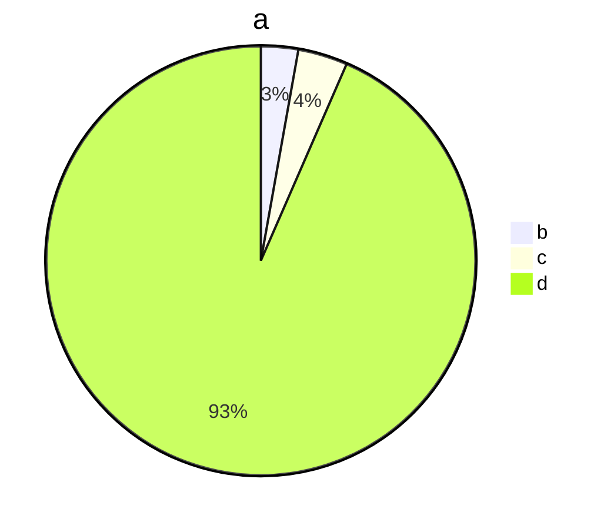
## 流程图
**语法**
1. 方向: 用于开头，声明流程图的方向。
- graph或graph TB或graph TD：从上往下
- graph BT：从下往上
- graph LR：从左往右
- graph RL：从右往左
2. 结点: 
- 无名字的结点：直接写内容，此时结点边框为方形；节点内容不支持空格
- 有名字的结点：节点名后书写内容，内容左右有特定符号，结点边框由符号决定；节点内容可以有空格
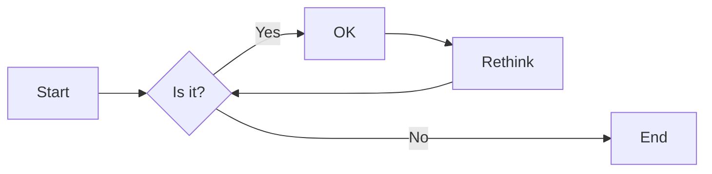
下面的实例中，没有为graph指定方向，因此默认是从上往下的。但是由于各个结点之前没有箭头，所以他们都处于同一排。id1-id6是节点名，可随意定义。

3. 连接样式
- 实现箭头: 分为无文本箭头和有文本箭头，有文本箭头有2种书写格式
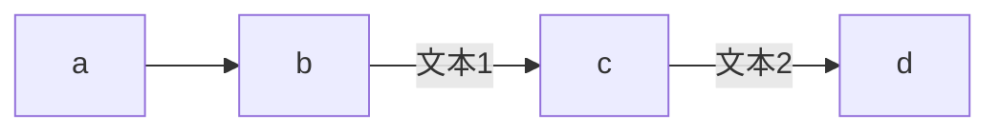
- 粗实线箭头：分为无文本箭头和有文本箭头
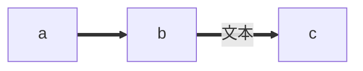
- 虚线箭头：分为无文本箭头和有文本箭头
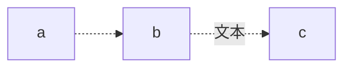
- 无箭头线：即以上三种连线去掉箭头后的形式
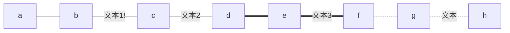
- 其他连线：需要将graph关键字改为flowchart，除了新增加的连线形式外，上面三种线的渲染效果也会不同
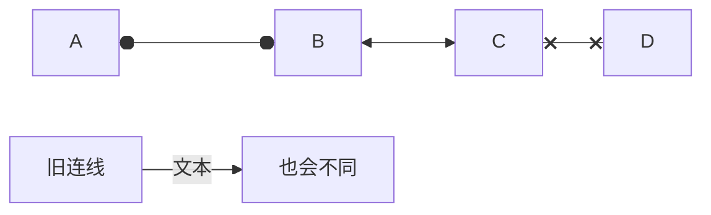
- 延长连线：增加相应字符即可，如下图中的B到E，连线中增加了一个-。字符可多次添加。
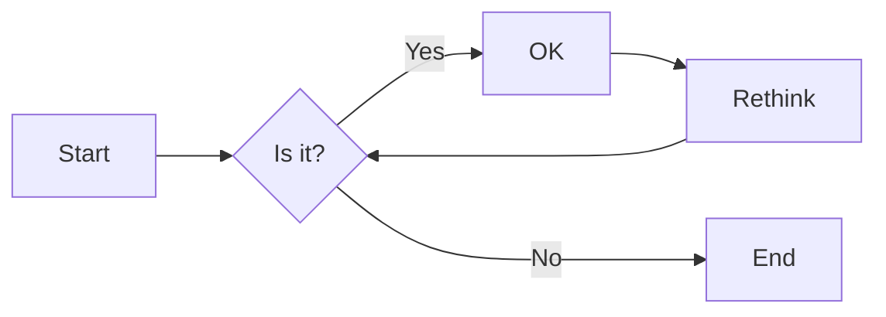
4. 连接形式
- 直链
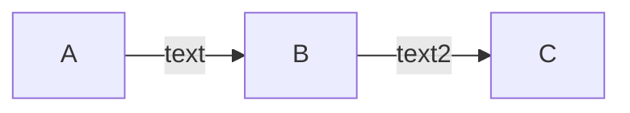
- 多重链：可以使用&字符，或单个描述
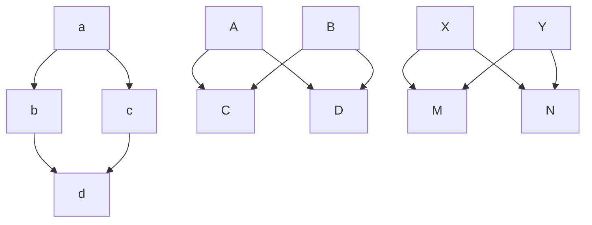
5. 其他
- 子图：需要将graph关键字改为flowchart，在代码段的开始加入subgraph，尾部加入end
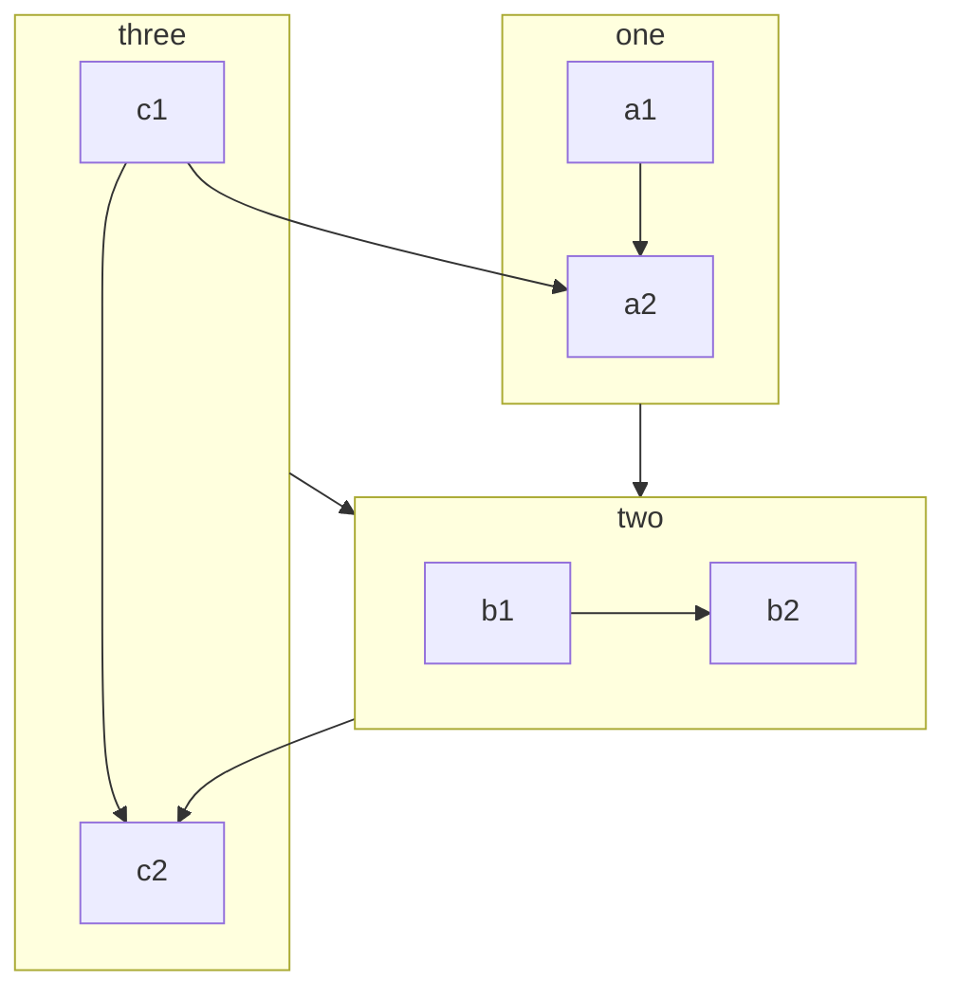
- 注释：在行首加入%%即可
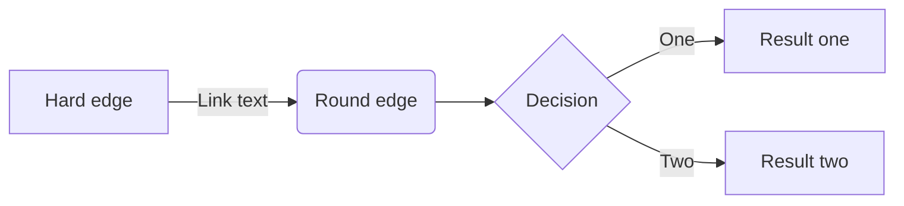